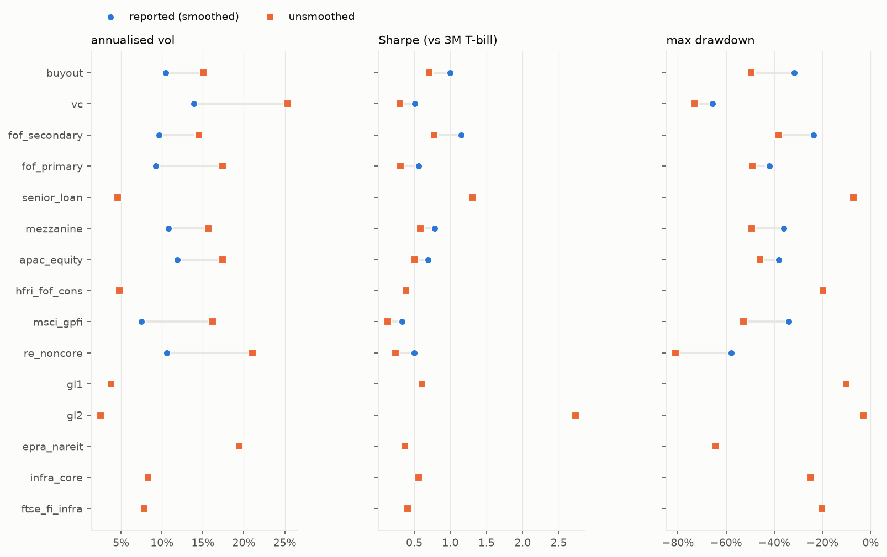
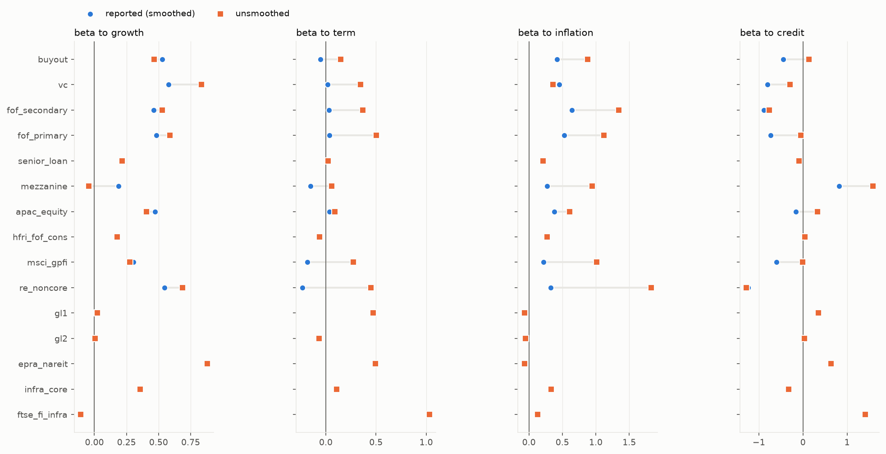
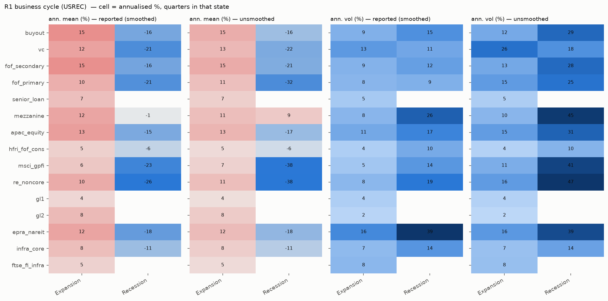
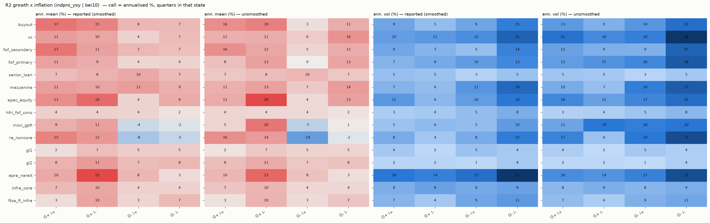
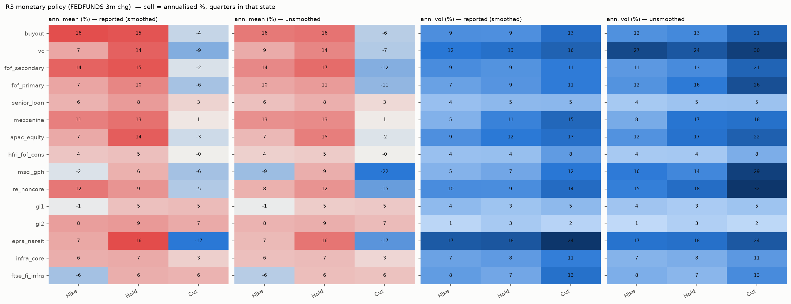
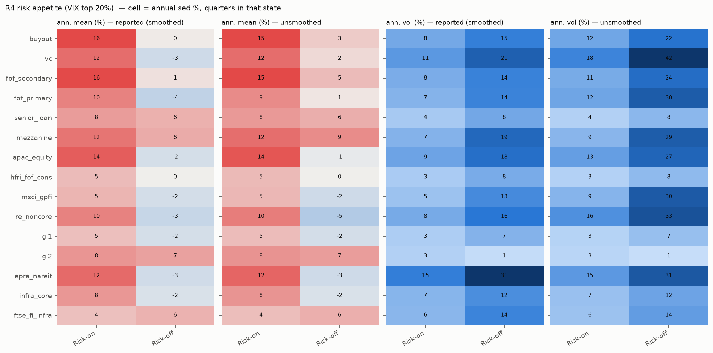
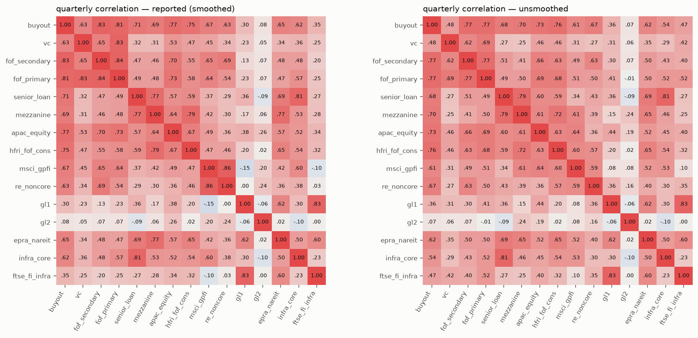
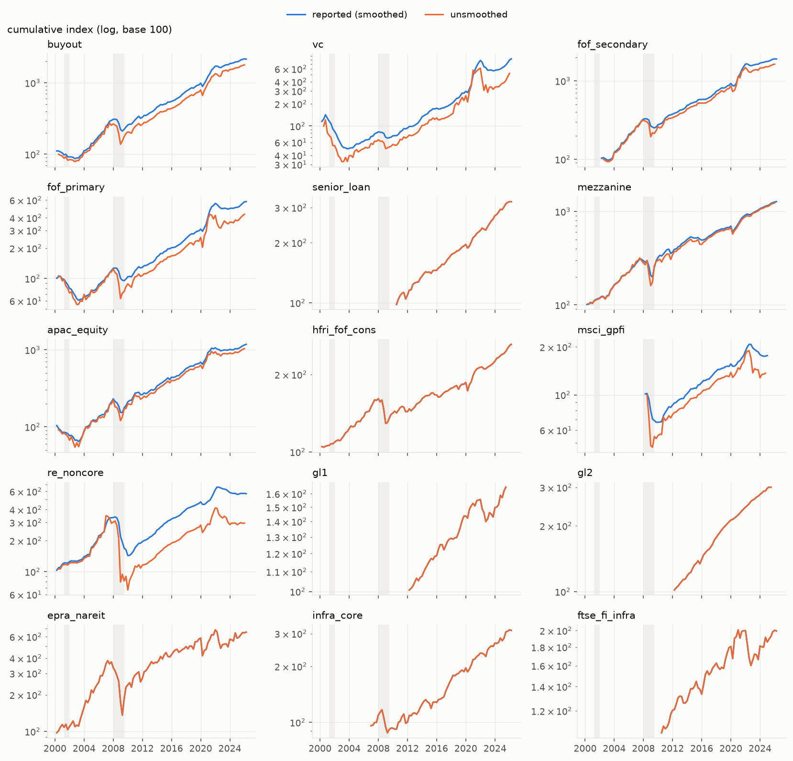
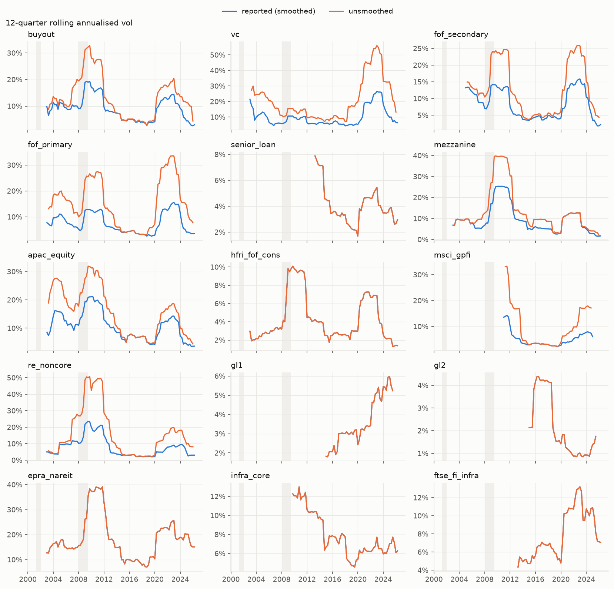

# 대체투자 수익률 EDA — 보고(스무딩) vs 언스무딩

언스무딩 설정: `config/nowcast.yaml` unsmoothing (차수 buyout 1, vc 1, fof_secondary 1, fof_primary 1, senior_loan 0, mezzanine 1, apac_equity 1, hfri_fof_cons 0, msci_gpfi 1, re_noncore 1, gl1 0, gl2 0, epra_nareit 0, infra_core 0, ftse_fi_infra 0). 레짐은 macro_factor 정의(R1 USREC · R2 indpro_yoy|bei10|R1_level · R3 FEDFUNDS 3개월 ±25bp · R4 VIX 상위 20% · R5 서사)를 분기 다수결로 모았다. 연율화: 평균 ×4, 변동성 ×2. 샤프는 3M T-bill 차감.

## 1. 기초 통계

| 시리즈 | n | 기간 | 기준 | 연수익(기하) | 연변동성 | 샤프 | 왜도 | 첨도 | 최악 분기 | MDD | AC1 |
|---|---|---|---|---|---|---|---|---|---|---|---|
| buyout | 105 | 2000-03-31~2026-03-31 | 보고(스무딩) | 12.4% | 10.5% | 1.00 | -0.66 | 3.1 | -18.9% | -31.7% | 0.36 |
|  | 103 | 2000-06-30~2025-12-31 | 언스무딩 | 11.8% | 15.0% | 0.70 | -0.64 | 4.6 | -29.3% | -49.5% | 0.06 |
| vc | 105 | 2000-03-31~2026-03-31 | 보고(스무딩) | 8.3% | 13.9% | 0.51 | 0.50 | 3.5 | -15.0% | -65.7% | 0.64 |
|  | 103 | 2000-06-30~2025-12-31 | 언스무딩 | 6.6% | 25.4% | 0.30 | 0.73 | 5.3 | -33.1% | -73.0% | -0.02 |
| fof_secondary | 97 | 2002-03-31~2026-03-31 | 보고(스무딩) | 12.9% | 9.6% | 1.15 | 0.47 | 4.6 | -16.1% | -23.6% | 0.40 |
|  | 95 | 2002-06-30~2025-12-31 | 언스무딩 | 12.5% | 14.5% | 0.78 | -0.22 | 6.8 | -30.6% | -38.2% | 0.01 |
| fof_primary | 105 | 2000-03-31~2026-03-31 | 보고(스무딩) | 6.9% | 9.3% | 0.56 | -0.07 | 2.3 | -14.3% | -42.1% | 0.60 |
|  | 103 | 2000-06-30~2025-12-31 | 언스무딩 | 5.9% | 17.4% | 0.31 | 0.01 | 3.6 | -29.1% | -49.2% | 0.05 |
| senior_loan | 64 | 2010-06-30~2026-03-31 | 보고(스무딩) | 7.6% | 4.6% | 1.30 | -1.02 | 3.2 | -7.2% | -7.2% | -0.03 |
|  | 64 | 2010-06-30~2026-03-31 | 언스무딩 | 7.6% | 4.6% | 1.30 | -1.02 | 3.2 | -7.2% | -7.2% | -0.03 |
| mezzanine | 105 | 2000-03-31~2026-03-31 | 보고(스무딩) | 10.2% | 10.8% | 0.78 | -0.19 | 7.4 | -19.8% | -36.0% | 0.30 |
|  | 103 | 2000-06-30~2025-12-31 | 언스무딩 | 10.3% | 15.6% | 0.58 | 0.90 | 15.1 | -28.0% | -49.4% | 0.15 |
| apac_equity | 105 | 2000-03-31~2026-03-31 | 보고(스무딩) | 9.9% | 11.9% | 0.69 | -0.06 | 0.9 | -17.4% | -38.1% | 0.38 |
|  | 103 | 2000-06-30~2025-12-31 | 언스무딩 | 9.5% | 17.4% | 0.50 | 0.09 | 0.8 | -23.1% | -45.9% | 0.02 |
| hfri_fof_cons | 105 | 2000-03-31~2026-03-31 | 보고(스무딩) | 3.7% | 4.8% | 0.38 | -2.22 | 9.0 | -11.5% | -19.9% | 0.20 |
|  | 105 | 2000-03-31~2026-03-31 | 언스무딩 | 3.7% | 4.8% | 0.38 | -2.22 | 9.0 | -11.5% | -19.9% | 0.20 |
| msci_gpfi | 68 | 2008-03-31~2024-12-31 | 보고(스무딩) | 3.4% | 7.5% | 0.33 | -1.78 | 6.2 | -15.5% | -34.1% | 0.64 |
|  | 66 | 2008-06-30~2024-09-30 | 언스무딩 | 1.9% | 16.2% | 0.14 | -1.42 | 8.4 | -33.9% | -52.8% | 0.21 |
| re_noncore | 105 | 2000-03-31~2026-03-31 | 보고(스무딩) | 6.9% | 10.6% | 0.50 | -1.55 | 9.4 | -26.9% | -57.8% | 0.59 |
|  | 103 | 2000-06-30~2025-12-31 | 언스무딩 | 4.3% | 21.0% | 0.24 | -1.84 | 15.3 | -62.1% | -80.9% | 0.02 |
| gl1 | 54 | 2012-03-31~2025-06-30 | 보고(스무딩) | 3.8% | 3.7% | 0.61 | -0.60 | 0.9 | -4.4% | -10.1% | 0.08 |
|  | 54 | 2012-03-31~2025-06-30 | 언스무딩 | 3.8% | 3.7% | 0.61 | -0.60 | 0.9 | -4.4% | -10.1% | 0.08 |
| gl2 | 54 | 2012-03-31~2025-06-30 | 보고(스무딩) | 8.5% | 2.5% | 2.73 | -0.96 | 5.3 | -3.1% | -3.1% | -0.03 |
|  | 54 | 2012-03-31~2025-06-30 | 언스무딩 | 8.5% | 2.5% | 2.73 | -0.96 | 5.3 | -3.1% | -3.1% | -0.03 |
| epra_nareit | 105 | 2000-03-31~2026-03-31 | 보고(스무딩) | 7.4% | 19.4% | 0.37 | -0.43 | 2.7 | -32.4% | -64.3% | 0.10 |
|  | 105 | 2000-03-31~2026-03-31 | 언스무딩 | 7.4% | 19.4% | 0.37 | -0.43 | 2.7 | -32.4% | -64.3% | 0.10 |
| infra_core | 78 | 2006-12-31~2026-03-31 | 보고(스무딩) | 6.0% | 8.3% | 0.56 | -0.75 | 1.3 | -10.8% | -24.8% | 0.12 |
|  | 78 | 2006-12-31~2026-03-31 | 언스무딩 | 6.0% | 8.3% | 0.56 | -0.75 | 1.3 | -10.8% | -24.8% | 0.12 |
| ftse_fi_infra | 64 | 2010-06-30~2026-03-31 | 보고(스무딩) | 4.4% | 7.8% | 0.40 | -0.00 | 1.4 | -8.6% | -20.3% | 0.01 |
|  | 64 | 2010-06-30~2026-03-31 | 언스무딩 | 4.4% | 7.8% | 0.40 | -0.00 | 1.4 | -8.6% | -20.3% | 0.01 |

## 2. 팩터 베타 (분기, HAC t)

| 시리즈 | 기준 | β growth | β term | β inflation | β credit | R² |
|---|---|---|---|---|---|---|
| buyout | 보고(스무딩) | 0.53 (4.4) | -0.06 (-0.4) | 0.42 (1.9) | -0.44 (-1.8) | 0.66 |
|  | 언스무딩 | 0.47 (3.0) | 0.15 (0.5) | 0.88 (1.4) | 0.14 (0.5) | 0.60 |
| vc | 보고(스무딩) | 0.58 (4.0) | 0.02 (0.1) | 0.45 (1.8) | -0.81 (-2.7) | 0.35 |
|  | 언스무딩 | 0.83 (4.0) | 0.35 (0.8) | 0.36 (0.8) | -0.30 (-0.5) | 0.29 |
| fof_secondary | 보고(스무딩) | 0.46 (3.7) | 0.03 (0.2) | 0.64 (3.2) | -0.89 (-3.3) | 0.44 |
|  | 언스무딩 | 0.53 (3.5) | 0.37 (1.5) | 1.34 (2.4) | -0.77 (-1.7) | 0.45 |
| fof_primary | 보고(스무딩) | 0.48 (4.6) | 0.04 (0.3) | 0.53 (3.2) | -0.73 (-2.8) | 0.55 |
|  | 언스무딩 | 0.59 (3.8) | 0.50 (1.9) | 1.12 (1.7) | -0.05 (-0.1) | 0.58 |
| senior_loan | 보고(스무딩) | 0.22 (3.2) | 0.02 (0.3) | 0.21 (1.8) | -0.09 (-0.6) | 0.59 |
|  | 언스무딩 | 0.22 (3.2) | 0.02 (0.3) | 0.21 (1.8) | -0.09 (-0.6) | 0.59 |
| mezzanine | 보고(스무딩) | 0.19 (2.6) | -0.15 (-1.5) | 0.27 (1.3) | 0.83 (3.5) | 0.83 |
|  | 언스무딩 | -0.04 (-0.3) | 0.06 (0.3) | 0.95 (3.3) | 1.59 (2.6) | 0.75 |
| apac_equity | 보고(스무딩) | 0.47 (4.1) | 0.03 (0.3) | 0.38 (1.7) | -0.16 (-0.6) | 0.58 |
|  | 언스무딩 | 0.41 (1.9) | 0.09 (0.4) | 0.61 (1.1) | 0.33 (0.9) | 0.52 |
| hfri_fof_cons | 보고(스무딩) | 0.18 (4.6) | -0.06 (-1.2) | 0.27 (2.2) | 0.04 (0.3) | 0.81 |
|  | 언스무딩 | 0.18 (4.6) | -0.06 (-1.2) | 0.27 (2.2) | 0.04 (0.3) | 0.81 |
| msci_gpfi | 보고(스무딩) | 0.30 (1.9) | -0.18 (-0.9) | 0.22 (0.7) | -0.60 (-2.4) | 0.27 |
|  | 언스무딩 | 0.27 (1.4) | 0.27 (1.0) | 1.02 (1.9) | -0.01 (-0.0) | 0.33 |
| re_noncore | 보고(스무딩) | 0.55 (2.6) | -0.23 (-1.0) | 0.33 (0.7) | -1.24 (-2.3) | 0.26 |
|  | 언스무딩 | 0.69 (2.2) | 0.45 (0.9) | 1.83 (1.2) | -1.28 (-1.3) | 0.26 |
| gl1 | 보고(스무딩) | 0.02 (0.6) | 0.47 (9.6) | -0.07 (-0.8) | 0.35 (3.5) | 0.85 |
|  | 언스무딩 | 0.02 (0.6) | 0.47 (9.6) | -0.07 (-0.8) | 0.35 (3.5) | 0.85 |
| gl2 | 보고(스무딩) | 0.00 (0.1) | -0.07 (-1.1) | -0.05 (-0.3) | 0.03 (0.2) | 0.03 |
|  | 언스무딩 | 0.00 (0.1) | -0.07 (-1.1) | -0.05 (-0.3) | 0.03 (0.2) | 0.03 |
| epra_nareit | 보고(스무딩) | 0.88 (5.0) | 0.49 (2.0) | -0.07 (-0.2) | 0.63 (1.2) | 0.75 |
|  | 언스무딩 | 0.88 (5.0) | 0.49 (2.0) | -0.07 (-0.2) | 0.63 (1.2) | 0.75 |
| infra_core | 보고(스무딩) | 0.36 (3.7) | 0.11 (0.6) | 0.34 (1.3) | -0.32 (-1.9) | 0.42 |
|  | 언스무딩 | 0.36 (3.7) | 0.11 (0.6) | 0.34 (1.3) | -0.32 (-1.9) | 0.42 |
| ftse_fi_infra | 보고(스무딩) | -0.11 (-3.6) | 1.03 (17.2) | 0.13 (1.3) | 1.42 (17.3) | 0.95 |
|  | 언스무딩 | -0.11 (-3.6) | 1.03 (17.2) | 0.13 (1.3) | 1.42 (17.3) | 0.95 |

리스크온/오프(R4) 별 growth 베타:

| 시리즈 | 기준 | β growth 리스크온 | β growth 리스크오프 | R² 온 | R² 오프 |
|---|---|---|---|---|---|
| buyout | 보고(스무딩) | 0.44 | 0.59 | 0.43 | 0.85 |
|  | 언스무딩 | 0.57 | 0.39 | 0.36 | 0.91 |
| vc | 보고(스무딩) | 0.43 | 0.78 | 0.22 | 0.55 |
|  | 언스무딩 | 0.73 | 1.20 | 0.21 | 0.40 |
| fof_secondary | 보고(스무딩) | 0.31 | 0.60 | 0.28 | 0.58 |
|  | 언스무딩 | 0.40 | 0.74 | 0.31 | 0.67 |
| fof_primary | 보고(스무딩) | 0.33 | 0.63 | 0.35 | 0.73 |
|  | 언스무딩 | 0.55 | 0.77 | 0.46 | 0.71 |
| senior_loan | 보고(스무딩) | | | | |
| senior_loan | 언스무딩 | | | | |
| mezzanine | 보고(스무딩) | 0.14 | 0.27 | 0.69 | 0.91 |
|  | 언스무딩 | 0.15 | -0.16 | 0.53 | 0.88 |
| apac_equity | 보고(스무딩) | 0.51 | 0.45 | 0.32 | 0.83 |
|  | 언스무딩 | 0.60 | 0.28 | 0.28 | 0.75 |
| hfri_fof_cons | 보고(스무딩) | 0.17 | 0.16 | 0.72 | 0.88 |
|  | 언스무딩 | 0.17 | 0.16 | 0.72 | 0.88 |
| msci_gpfi | 보고(스무딩) | 0.07 | 0.45 | 0.14 | 0.38 |
|  | 언스무딩 | 0.05 | 0.48 | 0.04 | 0.56 |
| re_noncore | 보고(스무딩) | 0.39 | 0.56 | 0.13 | 0.41 |
|  | 언스무딩 | 0.70 | 0.59 | 0.14 | 0.75 |
| gl1 | 보고(스무딩) | | | | |
| gl1 | 언스무딩 | | | | |
| gl2 | 보고(스무딩) | | | | |
| gl2 | 언스무딩 | | | | |
| epra_nareit | 보고(스무딩) | 0.53 | 1.24 | 0.65 | 0.88 |
|  | 언스무딩 | 0.53 | 1.24 | 0.65 | 0.88 |
| infra_core | 보고(스무딩) | 0.19 | 0.48 | 0.20 | 0.70 |
|  | 언스무딩 | 0.19 | 0.48 | 0.20 | 0.70 |
| ftse_fi_infra | 보고(스무딩) | | | | |
| ftse_fi_infra | 언스무딩 | | | | |

## 레짐 R1_경기 — 연율 평균 / 연율 변동성 (n)

| 시리즈 | 기준 | 확장 | 침체 |
|---|---|---|---|
| buyout | 보고(스무딩) | 15.0% / 9.0% (96) | -15.8% / 14.9% (9) |
|  | 언스무딩 | 15.2% / 12.4% (94) | -15.7% / 28.8% (9) |
| vc | 보고(스무딩) | 11.9% / 13.3% (96) | -21.3% / 10.9% (9) |
|  | 언스무딩 | 12.5% / 25.6% (94) | -21.9% / 17.7% (9) |
| fof_secondary | 보고(스무딩) | 14.7% / 8.7% (91) | -16.1% / 12.3% (6) |
|  | 언스무딩 | 15.3% / 12.6% (89) | -21.3% / 27.8% (6) |
| fof_primary | 보고(스무딩) | 9.8% / 8.2% (96) | -20.7% / 9.2% (9) |
|  | 언스무딩 | 11.0% / 15.5% (94) | -31.6% / 24.8% (9) |
| senior_loan | 보고(스무딩) | 7.5% / 4.6% (64) | – |
|  | 언스무딩 | 7.5% / 4.6% (64) | – |
| mezzanine | 보고(스무딩) | 11.5% / 8.2% (96) | -1.4% / 26.1% (9) |
|  | 언스무딩 | 11.3% / 9.7% (94) | 8.5% / 45.1% (9) |
| apac_equity | 보고(스무딩) | 12.6% / 10.6% (96) | -15.1% / 17.3% (9) |
|  | 언스무딩 | 13.3% / 15.2% (94) | -16.5% / 30.7% (9) |
| hfri_fof_cons | 보고(스무딩) | 4.7% / 3.7% (96) | -6.0% / 10.3% (9) |
|  | 언스무딩 | 4.7% / 3.7% (96) | -6.0% / 10.3% (9) |
| msci_gpfi | 보고(스무딩) | 6.2% / 5.2% (62) | -23.2% / 13.7% (6) |
|  | 언스무딩 | 6.7% / 11.5% (61) | -37.7% / 41.4% (5) |
| re_noncore | 보고(스무딩) | 10.4% / 7.9% (96) | -26.0% / 19.4% (9) |
|  | 언스무딩 | 11.3% / 15.6% (94) | -38.3% / 46.6% (9) |
| gl1 | 보고(스무딩) | 3.8% / 3.7% (54) | – |
|  | 언스무딩 | 3.8% / 3.7% (54) | – |
| gl2 | 보고(스무딩) | 8.3% / 2.5% (54) | – |
|  | 언스무딩 | 8.3% / 2.5% (54) | – |
| epra_nareit | 보고(스무딩) | 11.7% / 16.3% (96) | -18.2% / 38.9% (9) |
|  | 언스무딩 | 11.7% / 16.3% (96) | -18.2% / 38.9% (9) |
| infra_core | 보고(스무딩) | 7.6% / 7.3% (72) | -11.0% / 14.0% (6) |
|  | 언스무딩 | 7.6% / 7.3% (72) | -11.0% / 14.0% (6) |
| ftse_fi_infra | 보고(스무딩) | 4.6% / 7.8% (64) | – |
|  | 언스무딩 | 4.6% / 7.8% (64) | – |

## 레짐 R2_성장인플레 — 연율 평균 / 연율 변동성 (n)

| 시리즈 | 기준 | 성장↑인플레↑ | 성장↑인플레↓ | 성장↓인플레↑ | 성장↓인플레↓ |
|---|---|---|---|---|---|
| buyout | 보고(스무딩) | 16.6% / 8.9% (54) | 14.6% / 5.4% (9) | 7.8% / 9.0% (15) | 7.3% / 14.9% (21) |
|  | 언스무딩 | 16.4% / 13.1% (53) | 18.7% / 9.1% (9) | 2.9% / 13.9% (15) | 11.2% / 21.6% (21) |
| vc | 보고(스무딩) | 11.3% / 10.1% (54) | 9.9% / 10.8% (9) | 4.0% / 12.3% (15) | 6.8% / 20.5% (21) |
|  | 언스무딩 | 10.7% / 20.7% (53) | 11.2% / 15.9% (9) | 6.2% / 17.8% (15) | 15.5% / 38.4% (21) |
| fof_secondary | 보고(스무딩) | 16.8% / 8.8% (54) | 10.7% / 6.8% (9) | 7.5% / 5.3% (15) | 6.6% / 14.0% (19) |
|  | 언스무딩 | 16.0% / 11.6% (53) | 12.4% / 9.2% (9) | 4.6% / 9.1% (15) | 11.2% / 24.9% (18) |
| fof_primary | 보고(스무딩) | 10.5% / 6.9% (54) | 9.0% / 8.4% (9) | 3.5% / 10.3% (15) | 3.9% / 13.3% (21) |
|  | 언스무딩 | 8.0% / 12.5% (53) | 13.3% / 14.5% (9) | 0.2% / 16.4% (15) | 12.5% / 27.7% (21) |
| senior_loan | 보고(스무딩) | 6.8% / 5.1% (32) | 8.3% / 4.7% (8) | 9.6% / 2.5% (10) | 6.9% / 4.7% (14) |
|  | 언스무딩 | 6.8% / 5.1% (32) | 8.3% / 4.7% (8) | 9.6% / 2.5% (10) | 6.9% / 4.7% (14) |
| mezzanine | 보고(스무딩) | 11.0% / 7.1% (54) | 10.3% / 5.6% (9) | 11.1% / 11.3% (15) | 8.6% / 19.1% (21) |
|  | 언스무딩 | 10.8% / 9.9% (53) | 13.5% / 6.6% (9) | 6.5% / 18.2% (15) | 14.1% / 27.0% (21) |
| apac_equity | 보고(스무딩) | 13.3% / 11.0% (54) | 18.3% / 6.3% (9) | 3.9% / 10.2% (15) | 9.3% / 15.5% (21) |
|  | 언스무딩 | 11.4% / 16.3% (53) | 28.3% / 12.0% (9) | 3.6% / 16.7% (15) | 13.0% / 22.0% (21) |
| hfri_fof_cons | 보고(스무딩) | 4.4% / 3.2% (54) | 4.2% / 3.7% (9) | 3.8% / 5.4% (15) | 1.9% / 7.8% (21) |
|  | 언스무딩 | 4.4% / 3.2% (54) | 4.2% / 3.7% (9) | 3.8% / 5.4% (15) | 1.9% / 7.8% (21) |
| msci_gpfi | 보고(스무딩) | 8.9% / 4.7% (29) | 10.7% / 5.9% (8) | -4.3% / 5.5% (13) | -2.3% / 10.4% (18) |
|  | 언스무딩 | 4.5% / 11.2% (28) | 20.4% / 19.2% (8) | -7.3% / 18.1% (12) | 0.9% / 19.7% (18) |
| re_noncore | 보고(스무딩) | 14.8% / 8.0% (54) | 12.1% / 4.0% (9) | -8.2% / 8.1% (15) | -4.9% / 15.0% (21) |
|  | 언스무딩 | 16.4% / 17.2% (53) | 14.2% / 6.0% (9) | -19.3% / 19.0% (15) | -2.3% / 31.5% (21) |
| gl1 | 보고(스무딩) | 2.2% / 3.8% (23) | 6.6% / 1.6% (7) | 4.5% / 4.7% (10) | 4.6% / 3.7% (14) |
|  | 언스무딩 | 2.2% / 3.8% (23) | 6.6% / 1.6% (7) | 4.5% / 4.7% (10) | 4.6% / 3.7% (14) |
| gl2 | 보고(스무딩) | 8.3% / 1.9% (23) | 11.5% / 2.0% (7) | 6.8% / 1.5% (10) | 7.6% / 3.7% (14) |
|  | 언스무딩 | 8.3% / 1.9% (23) | 11.5% / 2.0% (7) | 6.8% / 1.5% (10) | 7.6% / 3.7% (14) |
| epra_nareit | 보고(스무딩) | 9.7% / 15.5% (54) | 23.0% / 14.4% (9) | 7.7% / 17.4% (15) | 2.7% / 31.2% (21) |
|  | 언스무딩 | 9.7% / 15.5% (54) | 23.0% / 14.4% (9) | 7.7% / 17.4% (15) | 2.7% / 31.2% (21) |
| infra_core | 보고(스무딩) | 7.2% / 7.6% (39) | 9.8% / 9.4% (8) | 4.0% / 8.3% (13) | 4.0% / 9.5% (18) |
|  | 언스무딩 | 7.2% / 7.6% (39) | 9.8% / 9.4% (8) | 4.0% / 8.3% (13) | 4.0% / 9.5% (18) |
| ftse_fi_infra | 보고(스무딩) | 2.5% / 6.7% (32) | 10.1% / 4.0% (8) | 3.4% / 8.9% (10) | 7.2% / 10.7% (14) |
|  | 언스무딩 | 2.5% / 6.7% (32) | 10.1% / 4.0% (8) | 3.4% / 8.9% (10) | 7.2% / 10.7% (14) |

## 레짐 R3_통화정책 — 연율 평균 / 연율 변동성 (n)

| 시리즈 | 기준 | 인상 | 동결 | 인하 |
|---|---|---|---|---|
| buyout | 보고(스무딩) | 16.0% / 9.3% (20) | 15.3% / 9.2% (68) | -3.6% / 13.4% (17) |
|  | 언스무딩 | 15.6% / 12.2% (19) | 16.3% / 13.4% (67) | -6.1% / 20.5% (17) |
| vc | 보고(스무딩) | 7.2% / 11.8% (20) | 14.1% / 13.1% (68) | -9.1% / 15.7% (17) |
|  | 언스무딩 | 8.9% / 27.1% (19) | 13.9% / 23.7% (67) | -6.9% / 29.6% (17) |
| fof_secondary | 보고(스무딩) | 14.0% / 9.5% (18) | 15.3% / 8.8% (66) | -1.9% / 11.4% (13) |
|  | 언스무딩 | 13.7% / 11.0% (18) | 17.4% / 13.0% (65) | -12.0% / 20.7% (12) |
| fof_primary | 보고(스무딩) | 7.3% / 7.2% (20) | 10.5% / 8.6% (68) | -6.2% / 11.4% (17) |
|  | 언스무딩 | 9.6% / 11.9% (19) | 11.1% / 15.7% (67) | -10.5% / 25.7% (17) |
| senior_loan | 보고(스무딩) | 6.1% / 3.8% (9) | 8.4% / 4.7% (48) | 2.8% / 4.8% (7) |
|  | 언스무딩 | 6.1% / 3.8% (9) | 8.4% / 4.7% (48) | 2.8% / 4.8% (7) |
| mezzanine | 보고(스무딩) | 11.1% / 5.4% (20) | 12.6% / 10.7% (68) | 0.9% / 14.8% (17) |
|  | 언스무딩 | 12.6% / 8.3% (19) | 13.3% / 16.6% (67) | 0.6% / 17.6% (17) |
| apac_equity | 보고(스무딩) | 7.0% / 9.2% (20) | 14.4% / 11.7% (68) | -2.9% / 13.2% (17) |
|  | 언스무딩 | 7.2% / 12.0% (19) | 14.9% / 17.3% (67) | -2.1% / 21.6% (17) |
| hfri_fof_cons | 보고(스무딩) | 4.0% / 3.7% (20) | 4.7% / 4.0% (68) | -0.0% / 7.9% (17) |
|  | 언스무딩 | 4.0% / 3.7% (20) | 4.7% / 4.0% (68) | -0.0% / 7.9% (17) |
| msci_gpfi | 보고(스무딩) | -1.7% / 5.3% (9) | 6.2% / 6.6% (51) | -6.3% / 11.9% (8) |
|  | 언스무딩 | -9.3% / 15.5% (9) | 8.6% / 13.6% (51) | -22.2% / 29.1% (6) |
| re_noncore | 보고(스무딩) | 11.9% / 9.6% (20) | 9.0% / 9.4% (68) | -5.2% / 14.0% (17) |
|  | 언스무딩 | 8.2% / 14.9% (19) | 12.3% / 18.4% (67) | -15.1% / 31.9% (17) |
| gl1 | 보고(스무딩) | -0.6% / 4.4% (9) | 4.6% / 3.4% (39) | 5.2% / 4.6% (6) |
|  | 언스무딩 | -0.6% / 4.4% (9) | 4.6% / 3.4% (39) | 5.2% / 4.6% (6) |
| gl2 | 보고(스무딩) | 7.9% / 1.3% (9) | 8.6% / 2.8% (39) | 6.8% / 1.6% (6) |
|  | 언스무딩 | 7.9% / 1.3% (9) | 8.6% / 2.8% (39) | 6.8% / 1.6% (6) |
| epra_nareit | 보고(스무딩) | 7.1% / 17.1% (20) | 16.2% / 17.8% (68) | -16.6% / 23.6% (17) |
|  | 언스무딩 | 7.1% / 17.1% (20) | 16.2% / 17.8% (68) | -16.6% / 23.6% (17) |
| infra_core | 보고(스무딩) | 6.4% / 7.1% (9) | 6.8% / 8.0% (58) | 3.2% / 11.1% (11) |
|  | 언스무딩 | 6.4% / 7.1% (9) | 6.8% / 8.0% (58) | 3.2% / 11.1% (11) |
| ftse_fi_infra | 보고(스무딩) | -6.3% / 7.8% (9) | 6.5% / 6.6% (48) | 5.9% / 13.0% (7) |
|  | 언스무딩 | -6.3% / 7.8% (9) | 6.5% / 6.6% (48) | 5.9% / 13.0% (7) |

## 레짐 R4_위험선호 — 연율 평균 / 연율 변동성 (n)

| 시리즈 | 기준 | 리스크온 | 리스크오프 |
|---|---|---|---|
| buyout | 보고(스무딩) | 15.7% / 8.4% (82) | 0.5% / 14.5% (23) |
|  | 언스무딩 | 15.1% / 11.9% (80) | 3.2% / 22.5% (23) |
| vc | 보고(스무딩) | 12.3% / 10.8% (82) | -2.6% / 20.9% (23) |
|  | 언스무딩 | 11.7% / 18.4% (80) | 2.0% / 41.9% (23) |
| fof_secondary | 보고(스무딩) | 15.5% / 7.8% (78) | 1.4% / 14.0% (19) |
|  | 언스무딩 | 15.0% / 10.8% (76) | 4.7% / 24.2% (19) |
| fof_primary | 보고(스무딩) | 10.2% / 6.9% (82) | -3.8% / 13.8% (23) |
|  | 언스무딩 | 9.1% / 12.0% (80) | 0.9% / 29.7% (23) |
| senior_loan | 보고(스무딩) | 7.7% / 3.6% (54) | 5.9% / 8.5% (10) |
|  | 언스무딩 | 7.7% / 3.6% (54) | 5.9% / 8.5% (10) |
| mezzanine | 보고(스무딩) | 11.5% / 6.9% (82) | 6.3% / 19.2% (23) |
|  | 언스무딩 | 11.7% / 8.7% (80) | 8.9% / 29.3% (23) |
| apac_equity | 보고(스무딩) | 13.7% / 9.1% (82) | -2.2% / 17.5% (23) |
|  | 언스무딩 | 13.9% / 13.4% (80) | -0.7% / 26.8% (23) |
| hfri_fof_cons | 보고(스무딩) | 4.8% / 3.3% (82) | 0.1% / 8.0% (23) |
|  | 언스무딩 | 4.8% / 3.3% (82) | 0.1% / 8.0% (23) |
| msci_gpfi | 보고(스무딩) | 5.5% / 4.7% (52) | -2.3% / 12.7% (16) |
|  | 언스무딩 | 5.0% / 9.0% (51) | -2.5% / 30.2% (15) |
| re_noncore | 보고(스무딩) | 10.2% / 8.2% (82) | -3.2% / 15.6% (23) |
|  | 언스무딩 | 10.4% / 16.2% (80) | -4.7% / 32.6% (23) |
| gl1 | 보고(스무딩) | 4.5% / 3.1% (48) | -2.2% / 7.0% (6) |
|  | 언스무딩 | 4.5% / 3.1% (48) | -2.2% / 7.0% (6) |
| gl2 | 보고(스무딩) | 8.4% / 2.6% (48) | 7.4% / 0.9% (6) |
|  | 언스무딩 | 8.4% / 2.6% (48) | 7.4% / 0.9% (6) |
| epra_nareit | 보고(스무딩) | 12.4% / 14.5% (82) | -2.6% / 31.0% (23) |
|  | 언스무딩 | 12.4% / 14.5% (82) | -2.6% / 31.0% (23) |
| infra_core | 보고(스무딩) | 8.3% / 6.6% (62) | -1.7% / 12.3% (16) |
|  | 언스무딩 | 8.3% / 6.6% (62) | -1.7% / 12.3% (16) |
| ftse_fi_infra | 보고(스무딩) | 4.4% / 6.3% (54) | 5.8% / 13.7% (10) |
|  | 언스무딩 | 4.4% / 6.3% (54) | 5.8% / 13.7% (10) |

## 레짐 R5_서사 — 연율 평균 / 연율 변동성 (n)

| 시리즈 | 기준 | 확장기 | 금융위기 | 양적완화·유럽위기·테이퍼 | 디스인플레·유가급락 | 후기 사이클 | 코로나 | 인플레이션·긴축 | 디스인플레·고금리 |
|---|---|---|---|---|---|---|---|---|---|
| buyout | 보고(스무딩) | 26.1% / 9.5% (20) | -7.6% / 18.4% (8) | 15.0% / 7.1% (16) | 10.5% / 3.9% (12) | 15.8% / 4.1% (12) | 24.2% / 21.6% (4) | 16.8% / 11.0% (8) | 7.4% / 3.0% (13) |
|  | 언스무딩 | 25.5% / 16.6% (20) | -7.8% / 31.8% (8) | 15.0% / 9.7% (16) | 10.6% / 4.2% (12) | 16.1% / 4.9% (12) | 26.7% / 30.8% (4) | 20.4% / 15.8% (8) | 7.0% / 4.4% (12) |
| vc | 보고(스무딩) | 9.2% / 6.9% (20) | -5.8% / 9.4% (8) | 15.3% / 6.7% (16) | 9.7% / 5.5% (12) | 17.7% / 5.2% (12) | 56.4% / 30.5% (4) | 10.3% / 22.5% (8) | 11.3% / 6.3% (13) |
|  | 언스무딩 | 15.2% / 17.2% (20) | -6.1% / 14.4% (8) | 15.6% / 9.8% (16) | 7.5% / 9.1% (12) | 26.3% / 19.8% (12) | 103.6% / 67.9% (4) | -26.9% / 36.6% (8) | 21.2% / 13.2% (12) |
| fof_secondary | 보고(스무딩) | 25.1% / 9.8% (20) | -7.2% / 13.5% (8) | 14.5% / 4.9% (16) | 7.7% / 3.6% (12) | 14.2% / 4.1% (12) | 22.3% / 23.6% (4) | 17.8% / 12.4% (8) | 5.7% / 2.1% (13) |
|  | 언스무딩 | 25.7% / 12.1% (20) | -5.3% / 27.9% (8) | 13.6% / 8.6% (16) | 7.7% / 4.3% (12) | 15.3% / 6.0% (12) | 34.9% / 39.0% (4) | 9.8% / 18.2% (8) | 6.3% / 4.4% (12) |
| fof_primary | 보고(스무딩) | 14.4% / 6.8% (20) | -8.9% / 12.6% (8) | 11.7% / 5.8% (16) | 9.4% / 3.6% (12) | 12.2% / 2.9% (12) | 30.1% / 18.7% (4) | 10.3% / 13.9% (8) | 5.0% / 3.4% (13) |
|  | 언스무딩 | 17.4% / 13.7% (20) | -12.1% / 30.3% (8) | 11.4% / 10.7% (16) | 9.4% / 3.6% (12) | 12.2% / 7.3% (12) | 54.3% / 49.6% (4) | -4.9% / 19.5% (8) | 8.1% / 7.7% (12) |
| senior_loan | 보고(스무딩) | – | – | 8.5% / 7.1% (15) | 4.5% / 3.3% (12) | 7.8% / 1.7% (12) | 8.3% / 8.7% (4) | 6.4% / 3.8% (8) | 9.0% / 2.9% (13) |
|  | 언스무딩 | – | – | 8.5% / 7.1% (15) | 4.5% / 3.3% (12) | 7.8% / 1.7% (12) | 8.3% / 8.7% (4) | 6.4% / 3.8% (8) | 9.0% / 2.9% (13) |
| mezzanine | 보고(스무딩) | 17.9% / 7.6% (20) | 8.3% / 31.2% (8) | 11.6% / 8.3% (16) | 2.9% / 5.3% (12) | 8.4% / 2.9% (12) | 7.4% / 22.0% (4) | 13.7% / 6.2% (8) | 8.8% / 1.6% (13) |
|  | 언스무딩 | 17.2% / 11.2% (20) | 13.0% / 48.5% (8) | 12.4% / 12.1% (16) | 4.1% / 9.6% (12) | 8.0% / 3.0% (12) | 7.4% / 22.0% (4) | 15.6% / 6.6% (8) | 8.6% / 2.0% (12) |
| apac_equity | 보고(스무딩) | 26.1% / 11.7% (20) | -2.3% / 22.2% (8) | 12.4% / 9.6% (16) | 10.8% / 6.6% (12) | 13.7% / 4.2% (12) | 31.7% / 19.8% (4) | 3.4% / 8.7% (8) | 5.6% / 3.5% (13) |
|  | 언스무딩 | 28.1% / 19.7% (20) | -0.3% / 34.5% (8) | 11.9% / 13.8% (16) | 10.8% / 6.6% (12) | 13.8% / 4.7% (12) | 35.9% / 25.9% (4) | 1.6% / 12.2% (8) | 5.5% / 4.4% (12) |
| hfri_fof_cons | 보고(스무딩) | 7.2% / 3.0% (20) | -5.8% / 11.4% (8) | 3.3% / 3.8% (16) | 1.8% / 2.6% (12) | 3.1% / 3.0% (12) | 6.9% / 12.2% (4) | 3.8% / 3.1% (8) | 6.3% / 1.4% (13) |
|  | 언스무딩 | 7.2% / 3.0% (20) | -5.8% / 11.4% (8) | 3.3% / 3.8% (16) | 1.8% / 2.6% (12) | 3.1% / 3.0% (12) | 6.9% / 12.2% (4) | 3.8% / 3.1% (8) | 6.3% / 1.4% (13) |
| msci_gpfi | 보고(스무딩) | – | -18.6% / 12.3% (8) | 10.6% / 5.0% (16) | 7.1% / 3.3% (12) | 7.4% / 2.7% (12) | 3.4% / 6.6% (4) | 10.4% / 7.4% (8) | -5.5% / 2.9% (8) |
|  | 언스무딩 | – | -26.1% / 35.5% (7) | 12.7% / 14.6% (16) | 7.1% / 3.3% (12) | 8.0% / 3.8% (12) | 7.3% / 12.1% (4) | -1.8% / 20.1% (8) | 0.3% / 11.0% (7) |
| re_noncore | 보고(스무딩) | 20.5% / 10.4% (20) | -38.8% / 17.3% (8) | 14.6% / 4.5% (16) | 10.7% / 2.3% (12) | 10.5% / 2.1% (12) | 1.6% / 8.5% (4) | 14.6% / 9.2% (8) | -3.3% / 2.9% (13) |
|  | 언스무딩 | 20.5% / 21.8% (20) | -52.3% / 51.1% (8) | 21.3% / 14.2% (16) | 10.8% / 2.4% (12) | 11.3% / 2.9% (12) | 4.6% / 21.9% (4) | 8.4% / 20.3% (8) | -3.5% / 8.1% (12) |
| gl1 | 보고(스무딩) | – | – | 3.7% / 2.0% (8) | 4.3% / 3.0% (12) | 5.5% / 2.4% (12) | 6.3% / 4.3% (4) | -3.6% / 4.9% (8) | 6.3% / 4.5% (10) |
|  | 언스무딩 | – | – | 3.7% / 2.0% (8) | 4.3% / 3.0% (12) | 5.5% / 2.4% (12) | 6.3% / 4.3% (4) | -3.6% / 4.9% (8) | 6.3% / 4.5% (10) |
| gl2 | 보고(스무딩) | – | – | 8.4% / 1.7% (8) | 9.5% / 4.2% (12) | 10.4% / 1.4% (12) | 5.4% / 1.0% (4) | 8.0% / 0.8% (8) | 5.4% / 1.7% (10) |
|  | 언스무딩 | – | – | 8.4% / 1.7% (8) | 9.5% / 4.2% (12) | 10.4% / 1.4% (12) | 5.4% / 1.0% (4) | 8.0% / 0.8% (8) | 5.4% / 1.7% (10) |
| epra_nareit | 보고(스무딩) | 23.5% / 16.1% (20) | -6.8% / 45.8% (8) | 11.9% / 16.2% (16) | 7.1% / 10.2% (12) | 9.5% / 10.3% (12) | -2.2% / 38.2% (4) | -0.1% / 20.4% (8) | 8.3% / 14.5% (13) |
|  | 언스무딩 | 23.5% / 16.1% (20) | -6.8% / 45.8% (8) | 11.9% / 16.2% (16) | 7.1% / 10.2% (12) | 9.5% / 10.3% (12) | -2.2% / 38.2% (4) | -0.1% / 20.4% (8) | 8.3% / 14.5% (13) |
| infra_core | 보고(스무딩) | 7.7% / 10.2% (5) | -7.4% / 12.4% (8) | 7.9% / 9.3% (16) | 3.2% / 7.0% (12) | 12.2% / 5.4% (12) | 10.9% / 10.2% (4) | 6.3% / 6.8% (8) | 7.6% / 6.0% (13) |
|  | 언스무딩 | 7.7% / 10.2% (5) | -7.4% / 12.4% (8) | 7.9% / 9.3% (16) | 3.2% / 7.0% (12) | 12.2% / 5.4% (12) | 10.9% / 10.2% (4) | 6.3% / 6.8% (8) | 7.6% / 6.0% (13) |
| ftse_fi_infra | 보고(스무딩) | – | – | 6.8% / 5.1% (15) | 5.8% / 7.1% (12) | 6.1% / 4.8% (12) | 11.8% / 17.5% (4) | -9.0% / 10.1% (8) | 6.0% / 6.9% (13) |
|  | 언스무딩 | – | – | 6.8% / 5.1% (15) | 5.8% / 7.1% (12) | 6.1% / 4.8% (12) | 11.8% / 17.5% (4) | -9.0% / 10.1% (8) | 6.0% / 6.9% (13) |

## 상관·누적·롤링 변동성

