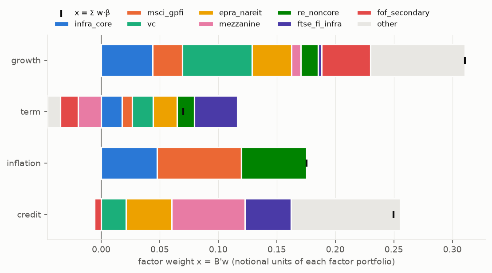
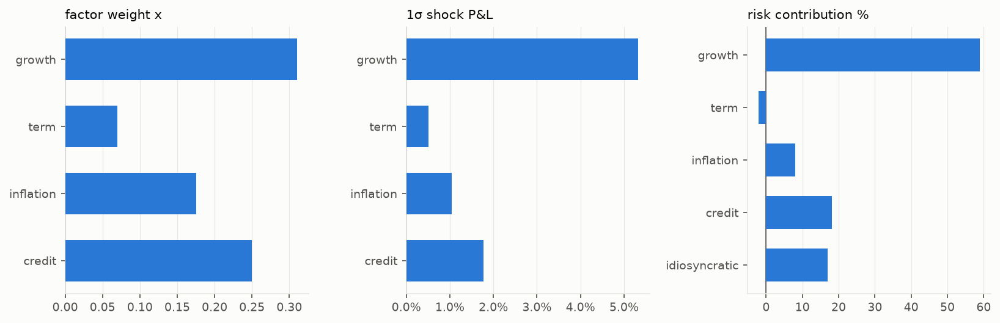
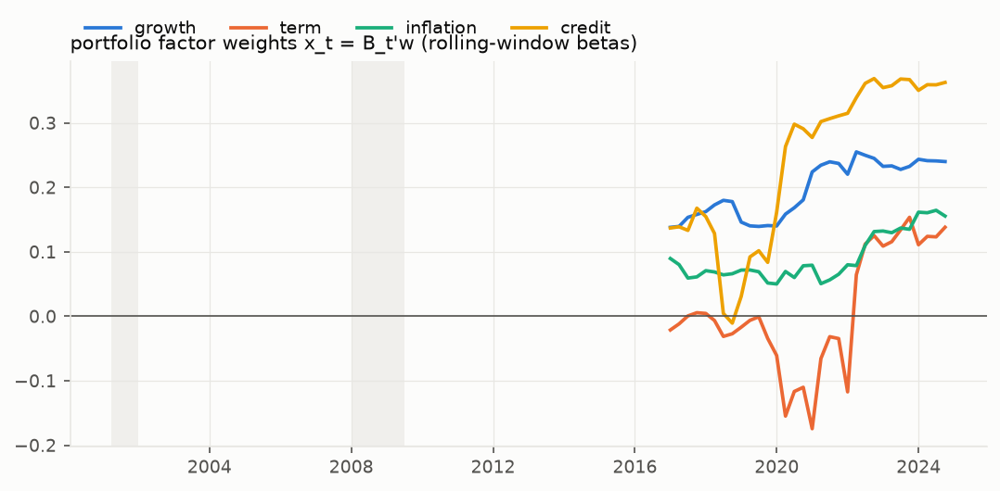
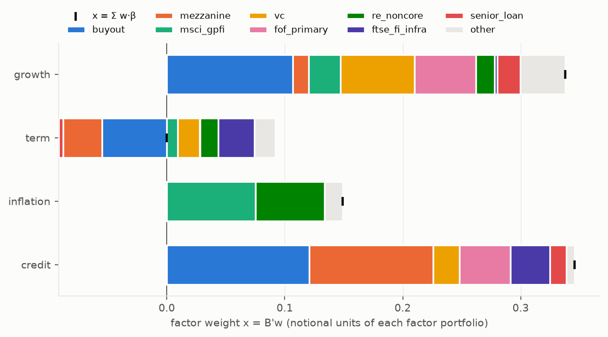
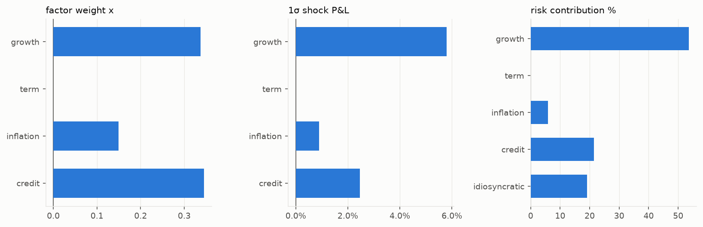
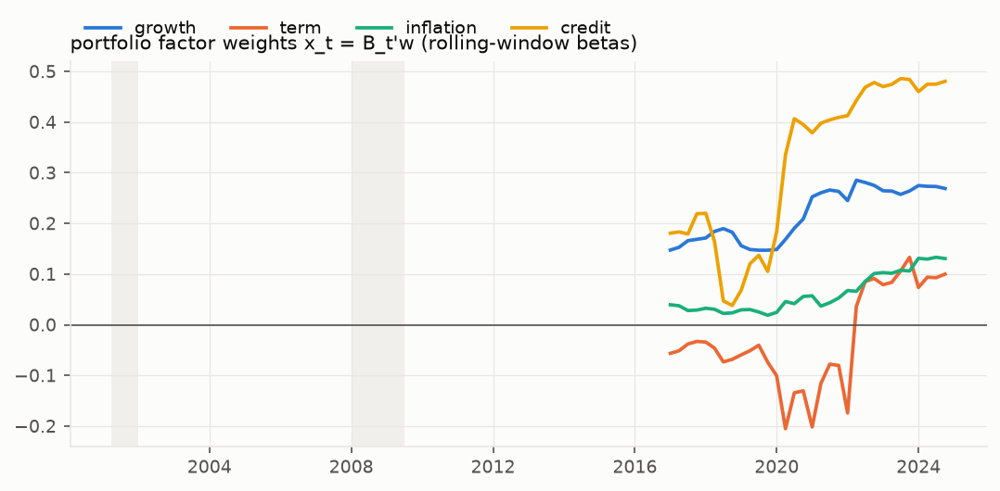

# 포트폴리오 팩터 비중

기준: unsmoothed 수익률 · ridge (λ common) · 블록 제약 True (앞 3개) · 팩터 Ω 는 분기 공분산 연율화.

정의: **팩터 비중 x = B′w** (각 팩터 포트폴리오의 명목 비중, 합 ≠ 1) · 1σ 손익 = x·σ_F (팩터 간 비교) · RC = 오일러 위험기여 (참고).

## 베타 행렬 B

| 시리즈 | growth | term | inflation | credit | λ | R² | n | 허용 |
|---|---|---|---|---|---|---|---|---|
| buyout | 0.43 | -0.22 | 0.00 | 0.48 | 10 | 0.56 | 79 | growth,credit,term |
| vc | 0.63 | 0.19 | 0.00 | 0.22 | 10 | 0.28 | 79 | growth,credit,term |
| fof_secondary | 0.44 | -0.16 | 0.00 | -0.06 | 10 | 0.34 | 79 | growth,credit,term |
| fof_primary | 0.52 | 0.00 | 0.00 | 0.43 | 10 | 0.52 | 79 | growth,credit,term |
| senior_loan | 0.16 | -0.03 | 0.00 | 0.12 | 10 | 0.56 | 64 | credit,term,growth |
| mezzanine | 0.17 | -0.41 | 0.00 | 1.31 | 10 | 0.71 | 79 | credit,growth,term |
| apac_equity | 0.38 | -0.18 | 0.00 | 0.54 | 10 | 0.50 | 79 | growth,credit,term |
| hfri_fof_cons | 0.16 | -0.16 | 0.00 | 0.17 | 10 | 0.77 | 80 | growth,credit,term |
| msci_gpfi | 0.27 | 0.09 | 0.75 | 0.00 | 10 | 0.33 | 66 | term,growth,inflation |
| re_noncore | 0.31 | 0.31 | 1.17 | 0.00 | 10 | 0.22 | 79 | growth,term,inflation |
| gl1 | 0.05 | 0.39 | 0.00 | 0.19 | 10 | 0.82 | 54 | term,credit,growth |
| gl2 | 0.00 | -0.04 | 0.00 | 0.02 | 10 | 0.03 | 54 | credit,term,growth |
| epra_nareit | 0.70 | 0.43 | 0.00 | 0.82 | 10 | 0.75 | 80 | growth,term,credit |
| infra_core | 0.23 | 0.09 | 0.25 | 0.00 | 10 | 0.40 | 78 | growth,inflation,term |
| ftse_fi_infra | 0.06 | 0.77 | 0.00 | 0.83 | 10 | 0.89 | 64 | term,credit,growth |

## 포트폴리오: 21 라벨 균등 (가안) ⚠가안

| 팩터 | **팩터 비중 x** | σ_F | 1σ 손익 | RC | RC% |
|---|---|---|---|---|---|
| growth | **0.311** | 17.2% | 5.3% | 4.79% | 59.0% |
| term | **0.070** | 7.3% | 0.5% | -0.17% | -2.1% |
| inflation | **0.175** | 6.0% | 1.1% | 0.65% | 8.1% |
| credit | **0.250** | 7.1% | 1.8% | 1.47% | 18.1% |
| 고유 | | | | 1.37% | 16.9% |

σ_p = 8.1%. 자산별 기여 w_i·β_i:

| 시리즈 | w | growth | term | inflation | credit |
|---|---|---|---|---|---|
| buyout | 4.8% | 0.020 | -0.010 | 0.000 | 0.023 |
| vc | 9.5% | 0.060 | 0.018 | 0.000 | 0.021 |
| fof_secondary | 9.5% | 0.042 | -0.015 | 0.000 | -0.006 |
| fof_primary | 4.8% | 0.025 | 0.000 | 0.000 | 0.021 |
| senior_loan | 4.8% | 0.008 | -0.002 | 0.000 | 0.006 |
| mezzanine | 4.8% | 0.008 | -0.020 | 0.000 | 0.062 |
| apac_equity | 4.8% | 0.018 | -0.008 | 0.000 | 0.026 |
| hfri_fof_cons | 4.8% | 0.007 | -0.008 | 0.000 | 0.008 |
| msci_gpfi | 9.5% | 0.025 | 0.009 | 0.072 | 0.000 |
| re_noncore | 4.8% | 0.015 | 0.015 | 0.056 | 0.000 |
| gl1 | 4.8% | 0.002 | 0.019 | 0.000 | 0.009 |
| gl2 | 4.8% | 0.000 | -0.002 | 0.000 | 0.001 |
| epra_nareit | 4.8% | 0.034 | 0.021 | 0.000 | 0.039 |
| infra_core | 19.0% | 0.044 | 0.018 | 0.048 | 0.000 |
| ftse_fi_infra | 4.8% | 0.003 | 0.037 | 0.000 | 0.040 |

롤링 20분기 베타로 본 x_t (λ=10 고정):

## 포트폴리오: 예시: PE 50 / 사모대출 20 / 부동산 20 / 인프라 10 ⚠가안

| 팩터 | **팩터 비중 x** | σ_F | 1σ 손익 | RC | RC% |
|---|---|---|---|---|---|
| growth | **0.338** | 17.2% | 5.8% | 5.10% | 53.6% |
| term | **-0.000** | 7.3% | -0.0% | 0.00% | 0.0% |
| inflation | **0.149** | 6.0% | 0.9% | 0.56% | 5.9% |
| credit | **0.346** | 7.1% | 2.5% | 2.04% | 21.4% |
| 고유 | | | | 1.82% | 19.1% |

σ_p = 9.5%. 자산별 기여 w_i·β_i:

| 시리즈 | w | growth | term | inflation | credit |
|---|---|---|---|---|---|
| buyout | 25.0% | 0.107 | -0.055 | 0.000 | 0.121 |
| vc | 10.0% | 0.063 | 0.019 | 0.000 | 0.022 |
| fof_secondary | 5.0% | 0.022 | -0.008 | 0.000 | -0.003 |
| fof_primary | 10.0% | 0.052 | 0.000 | 0.000 | 0.043 |
| senior_loan | 12.0% | 0.020 | -0.004 | 0.000 | 0.014 |
| mezzanine | 8.0% | 0.014 | -0.033 | 0.000 | 0.105 |
| msci_gpfi | 10.0% | 0.027 | 0.009 | 0.075 | 0.000 |
| re_noncore | 5.0% | 0.016 | 0.015 | 0.058 | 0.000 |
| gl1 | 5.0% | 0.002 | 0.020 | 0.000 | 0.010 |
| infra_core | 6.0% | 0.014 | 0.006 | 0.015 | 0.000 |
| ftse_fi_infra | 4.0% | 0.002 | 0.031 | 0.000 | 0.033 |

롤링 20분기 베타로 본 x_t (λ=10 고정):

## 주의
- x 는 명목 노출이라 팩터 간 크기 비교는 1σ 손익·RC 로 한다.
- 블록 제약·ridge 축소는 사람이 정한 것이다 (config/portfolio.yaml, nowcast.yaml beta_priority). 바꾸면 x 가 바뀐다.
- 감정평가 부동산(MSCI GPFI·Burgiss RE)은 동분기 베타가 lag 를 못 잡아 과소일 수 있다.