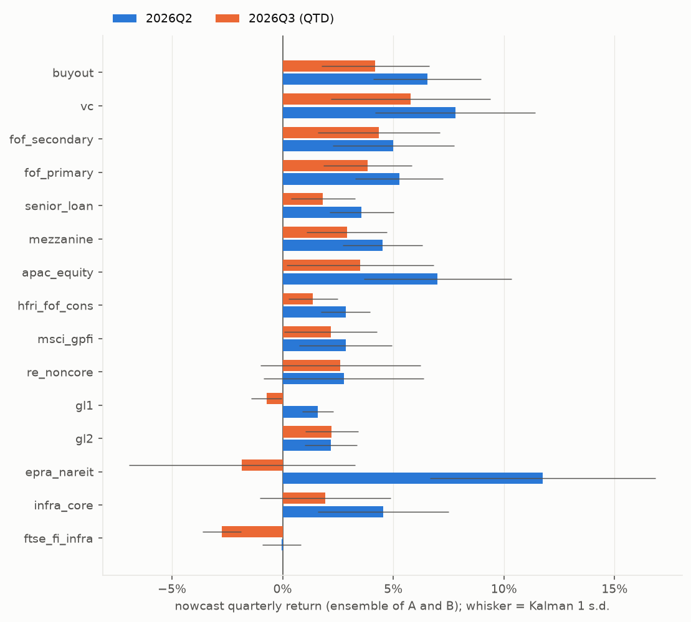
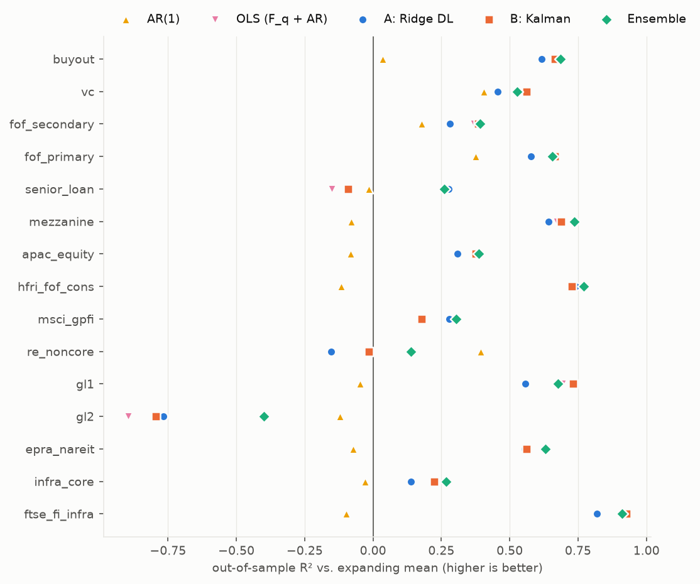
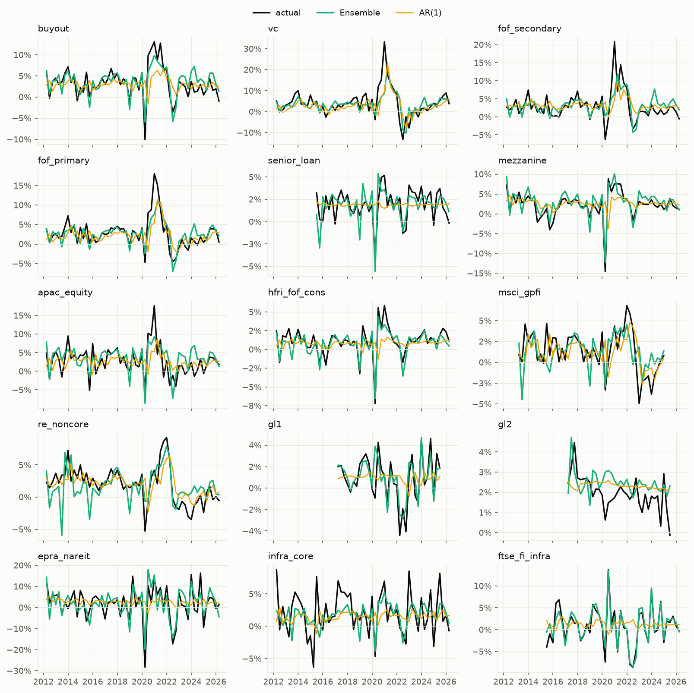
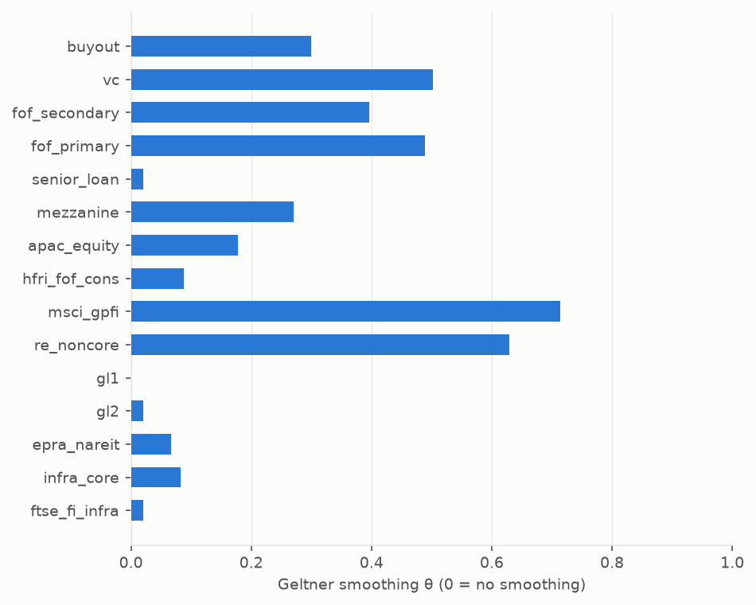
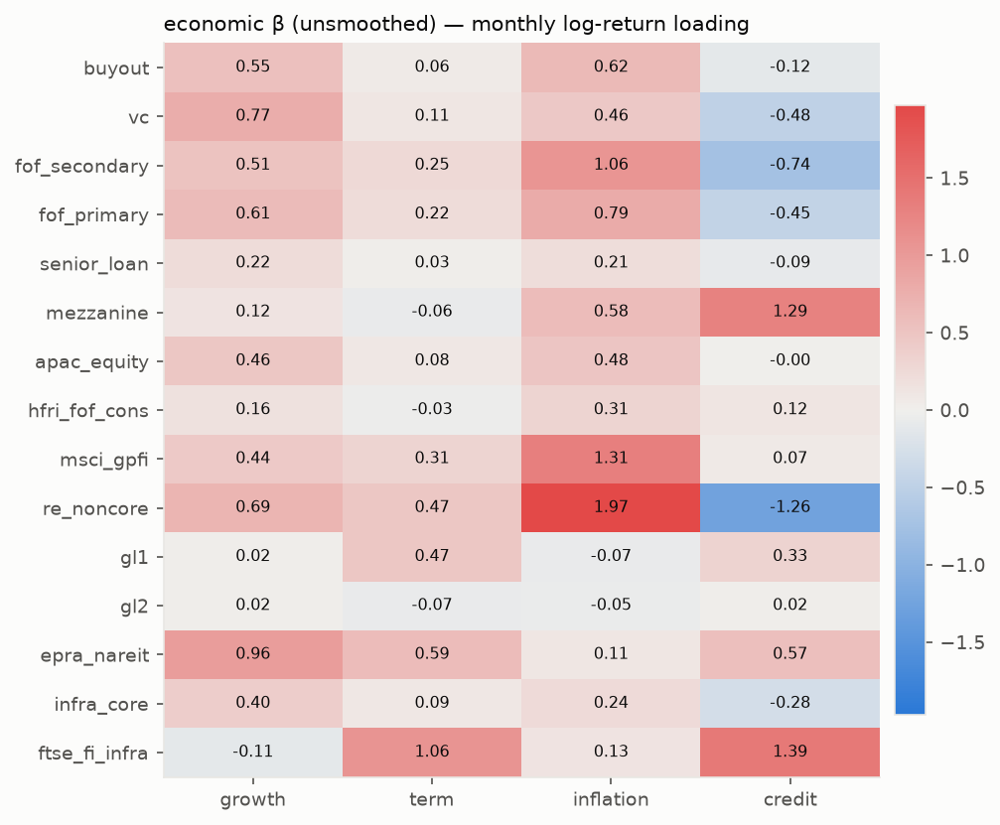

# 대체투자 분기수익률 Nowcast 리포트

팩터 기준일 **2026-09-15** · 진행 중 분기 2026Q3 (경과 영업일 55) · 팩터 = macro_factor `factors.csv` (growth / term / inflation / credit, 2006-02~)

QTD 팩터: growth 1.07%, term -2.93%, inflation 1.03%, credit -0.03%

## 1. 최신 nowcast (시리즈별)

| 시리즈 | 그룹 | 분기 | 유형 | h | A: Ridge DL | B: Kalman | B s.d. | **Ensemble** |
|---|---|---|---|---|---|---|---|---|
| buyout | PE | 2026Q2 | complete | 1 | 6.07% | 7.00% | 2.44% | **6.54%** |
| buyout | PE | 2026Q3 | partial(QTD) | 2 | 3.97% | 4.42% | 2.44% | **4.19%** |
| vc | PE | 2026Q2 | complete | 1 | 7.22% | 8.39% | 3.61% | **7.80%** |
| vc | PE | 2026Q3 | partial(QTD) | 2 | 5.83% | 5.74% | 3.61% | **5.78%** |
| fof_secondary | PE | 2026Q2 | complete | 1 | 4.69% | 5.32% | 2.76% | **5.01%** |
| fof_secondary | PE | 2026Q3 | partial(QTD) | 2 | 4.78% | 3.91% | 2.76% | **4.34%** |
| fof_primary | PE | 2026Q2 | complete | 1 | 5.11% | 5.42% | 1.99% | **5.26%** |
| fof_primary | PE | 2026Q3 | partial(QTD) | 2 | 3.89% | 3.80% | 1.99% | **3.84%** |
| senior_loan | PE | 2026Q2 | complete | 1 | 2.71% | 4.43% | 1.45% | **3.57%** |
| senior_loan | PE | 2026Q3 | partial(QTD) | 2 | 1.81% | 1.84% | 1.45% | **1.83%** |
| mezzanine | PE | 2026Q2 | complete | 1 | 4.77% | 4.24% | 1.80% | **4.51%** |
| mezzanine | PE | 2026Q3 | partial(QTD) | 2 | 2.76% | 3.05% | 1.80% | **2.90%** |
| apac_equity | PE | 2026Q2 | complete | 1 | 6.35% | 7.67% | 3.33% | **7.01%** |
| apac_equity | PE | 2026Q3 | partial(QTD) | 2 | 3.41% | 3.60% | 3.33% | **3.51%** |
| hfri_fof_cons | HF | 2026Q2 | complete | 1 | 2.69% | 3.00% | 1.11% | **2.85%** |
| hfri_fof_cons | HF | 2026Q3 | partial(QTD) | 2 | 1.46% | 1.29% | 1.11% | **1.38%** |
| msci_gpfi | RE | 2025Q1 | complete | 1 | 0.88% | 0.86% | 2.10% | **0.87%** |
| msci_gpfi | RE | 2025Q2 | complete | 2 | 1.28% | 1.80% | 2.10% | **1.54%** |
| msci_gpfi | RE | 2025Q3 | complete | 3 | 1.92% | 2.53% | 2.10% | **2.22%** |
| msci_gpfi | RE | 2025Q4 | complete | 4 | 1.57% | 1.93% | 2.10% | **1.75%** |
| msci_gpfi | RE | 2026Q1 | complete | 5 | 1.16% | 1.06% | 2.10% | **1.11%** |
| msci_gpfi | RE | 2026Q2 | complete | 6 | 2.88% | 2.82% | 2.10% | **2.85%** |
| msci_gpfi | RE | 2026Q3 | partial(QTD) | 7 | 2.07% | 2.27% | 2.10% | **2.17%** |
| re_noncore | RE | 2026Q2 | complete | 1 | 2.22% | 3.30% | 3.62% | **2.76%** |
| re_noncore | RE | 2026Q3 | partial(QTD) | 2 | 2.56% | 2.66% | 3.62% | **2.61%** |
| gl1 | RE | 2025Q3 | complete | 1 | 2.22% | 1.91% | 0.70% | **2.07%** |
| gl1 | RE | 2025Q4 | complete | 2 | 1.11% | 1.30% | 0.70% | **1.20%** |
| gl1 | RE | 2026Q1 | complete | 3 | -0.03% | 0.13% | 0.70% | **0.05%** |
| gl1 | RE | 2026Q2 | complete | 4 | 1.89% | 1.28% | 0.70% | **1.59%** |
| gl1 | RE | 2026Q3 | partial(QTD) | 5 | -0.63% | -0.83% | 0.70% | **-0.73%** |
| gl2 | RE | 2025Q3 | complete | 1 | 2.45% | 1.99% | 1.19% | **2.22%** |
| gl2 | RE | 2025Q4 | complete | 2 | 1.87% | 2.07% | 1.19% | **1.97%** |
| gl2 | RE | 2026Q1 | complete | 3 | 2.06% | 1.98% | 1.19% | **2.02%** |
| gl2 | RE | 2026Q2 | complete | 4 | 2.11% | 2.24% | 1.19% | **2.18%** |
| gl2 | RE | 2026Q3 | partial(QTD) | 5 | 2.21% | 2.23% | 1.19% | **2.22%** |
| epra_nareit | RE | 2026Q2 | complete | 1 | 10.75% | 12.75% | 5.11% | **11.75%** |
| epra_nareit | RE | 2026Q3 | partial(QTD) | 2 | -2.99% | -0.68% | 5.11% | **-1.84%** |
| infra_core | INFRA | 2026Q2 | complete | 1 | 3.24% | 5.84% | 2.96% | **4.54%** |
| infra_core | INFRA | 2026Q3 | partial(QTD) | 2 | 2.05% | 1.78% | 2.96% | **1.92%** |
| ftse_fi_infra | INFRA | 2026Q2 | complete | 1 | -0.42% | 0.35% | 0.88% | **-0.04%** |
| ftse_fi_infra | INFRA | 2026Q3 | partial(QTD) | 2 | -2.63% | -2.85% | 0.88% | **-2.74%** |

h = 마지막 보고 분기 이후 몇 번째 분기인가 (h≥2 는 직전 nowcast 를 y_{q−1} 로 넣은 반복 예측). partial(QTD) 는 진행 중 분기: 관측된 QTD 팩터 + 남은 기간 무조건 평균.

## 2. 최신 nowcast (엑셀 21 라벨, Ensemble)

| 라벨 | 2025Q1 | 2025Q2 | 2025Q3 | 2025Q4 | 2026Q1 | 2026Q2 | 2026Q3 |
|---|---|---|---|---|---|---|---|
| Buyout |  |  |  |  |  | 6.54% | 4.19% |
| Growth |  |  |  |  |  | 7.80% | 5.78% |
| Venture Capital |  |  |  |  |  | 7.80% | 5.78% |
| Fund of Fund |  |  |  |  |  | 5.01% | 4.34% |
| GP-Stake / Continuation Vehicle |  |  |  |  |  | 5.01% | 4.34% |
| Long-term Core |  |  |  |  |  | 5.26% | 3.84% |
| Senior Credit |  |  |  |  |  | 3.57% | 1.83% |
| Junior Credit |  |  |  |  |  | 4.51% | 2.90% |
| 국내 사모투자 |  |  |  |  |  | 7.01% | 3.51% |
| Hedge Fund |  |  |  |  |  | 2.85% | 1.38% |
| Core RE Equity | 0.87% | 1.54% | 2.22% | 1.75% | 1.11% | 2.85% | 2.17% |
| 국내 부동산 | 0.87% | 1.54% | 2.22% | 1.75% | 1.11% | 2.85% | 2.17% |
| Non-Core RE Equity |  |  |  |  |  | 2.76% | 2.61% |
| Core RE Debt |  |  | 2.07% | 1.20% | 0.05% | 1.59% | -0.73% |
| Non-Core RE Debt |  |  | 2.22% | 1.97% | 2.02% | 2.18% | 2.22% |
| Listed RE |  |  |  |  |  | 11.75% | -1.84% |
| Core 국내 인프라 |  |  |  |  |  | 4.54% | 1.92% |
| Non-Core 국내 인프라 |  |  |  |  |  | 4.54% | 1.92% |
| Core 해외 인프라 |  |  |  |  |  | 4.54% | 1.92% |
| Non-Core 해외 인프라 |  |  |  |  |  | 4.54% | 1.92% |
| Super-Core Infrastructure |  |  |  |  |  | -0.04% | -2.74% |

## 3. 백테스트 (확장창, pseudo-real-time OOS)

첫 OOS 분기 2012Q1, 최소 훈련 20분기. 매 분기 모든 모델을 그 시점까지의 자료로 다시 추정. 벤치마크: 확장창 평균, AR(1).

| 시리즈 | n | RMSE 평균 | RMSE AR(1) | RMSE OLS | RMSE A | RMSE B | **RMSE Ens** | R²_OOS Ens | 적중률 Ens | DM p (Ens vs AR1) |
|---|---|---|---|---|---|---|---|---|---|---|
| buyout | 57 | 3.79% | 3.72% | 2.19% | 2.34% | 2.19% | **2.13%** | 0.68 | 0.95 | 0.020 |
| vc | 57 | 7.09% | 5.47% | 4.70% | 5.23% | 4.69% | **4.88%** | 0.53 | 0.88 | 0.057 |
| fof_secondary | 57 | 4.03% | 3.65% | 3.20% | 3.42% | 3.16% | **3.14%** | 0.39 | 0.88 | 0.079 |
| fof_primary | 57 | 4.14% | 3.27% | 2.38% | 2.69% | 2.39% | **2.43%** | 0.65 | 0.89 | 0.017 |
| senior_loan | 44 | 1.75% | 1.77% | 1.88% | 1.49% | 1.83% | **1.51%** | 0.26 | 0.84 | 0.383 |
| mezzanine | 57 | 3.39% | 3.52% | 1.94% | 2.03% | 1.90% | **1.74%** | 0.74 | 0.91 | 0.122 |
| apac_equity | 57 | 4.00% | 4.16% | 3.17% | 3.33% | 3.16% | **3.13%** | 0.39 | 0.88 | 0.039 |
| hfri_fof_cons | 57 | 1.92% | 2.03% | 1.00% | 0.98% | 1.00% | **0.92%** | 0.77 | 0.88 | 0.027 |
| msci_gpfi | 48 | 2.60% | 2.20% | 2.36% | 2.21% | 2.36% | **2.17%** | 0.30 | 0.75 | 0.926 |
| re_noncore | 57 | 2.79% | 2.17% | 2.58% | 3.00% | 2.81% | **2.59%** | 0.14 | 0.74 | 0.309 |
| gl1 | 34 | 2.15% | 2.20% | 1.19% | 1.43% | 1.12% | **1.23%** | 0.68 | 0.91 | 0.010 |
| gl2 | 34 | 0.88% | 0.93% | 1.21% | 1.17% | 1.18% | **1.04%** | -0.40 | 0.97 | 0.149 |
| epra_nareit | 57 | 7.67% | 7.94% | 5.08% | 5.12% | 5.08% | **4.66%** | 0.63 | 0.81 | 0.023 |
| infra_core | 57 | 3.44% | 3.49% | 3.04% | 3.20% | 3.03% | **2.95%** | 0.27 | 0.70 | 0.011 |
| ftse_fi_infra | 44 | 4.45% | 4.67% | 1.21% | 1.89% | 1.21% | **1.33%** | 0.91 | 0.89 | 0.002 |

그룹 평균 R²_OOS (대 확장창 평균):

| 그룹 | AR(1) | OLS (F_q + AR) | A: Ridge DL | B: Kalman | Ensemble |
|---|---|---|---|---|---|
| HF | -0.12 | 0.73 | 0.74 | 0.73 | 0.77 |
| INFRA | -0.06 | 0.57 | 0.48 | 0.58 | 0.59 |
| PE | 0.12 | 0.45 | 0.45 | 0.46 | 0.52 |
| RE | 0.09 | 0.14 | 0.09 | 0.13 | 0.27 |

## 4. 모델 B 추정치 — 스무딩 θ 와 팩터 베타 (전체 표본)

| 시리즈 | θ | α(월) | σ_η(월) | β growth | β term | β inflation | β credit | (1−θ)β growth | (1−θ)β term | (1−θ)β inflation | (1−θ)β credit |
|---|---|---|---|---|---|---|---|---|---|---|---|
| buyout | 0.30 | 0.68% | 2.01% | 0.55 | 0.06 | 0.62 | -0.12 | 0.39 | 0.04 | 0.43 | -0.08 |
| vc | 0.50 | 0.61% | 4.19% | 0.77 | 0.11 | 0.46 | -0.48 | 0.39 | 0.05 | 0.23 | -0.24 |
| fof_secondary | 0.40 | 0.62% | 2.64% | 0.51 | 0.25 | 1.06 | -0.74 | 0.31 | 0.15 | 0.64 | -0.45 |
| fof_primary | 0.49 | 0.39% | 2.25% | 0.61 | 0.22 | 0.79 | -0.45 | 0.31 | 0.11 | 0.40 | -0.23 |
| senior_loan | 0.02 | 0.44% | 0.85% | 0.22 | 0.03 | 0.21 | -0.09 | 0.21 | 0.03 | 0.20 | -0.09 |
| mezzanine | 0.27 | 0.53% | 1.43% | 0.12 | -0.06 | 0.58 | 1.29 | 0.09 | -0.05 | 0.43 | 0.94 |
| apac_equity | 0.18 | 0.59% | 2.34% | 0.46 | 0.08 | 0.48 | -0.00 | 0.38 | 0.07 | 0.40 | -0.00 |
| hfri_fof_cons | 0.09 | 0.16% | 0.70% | 0.16 | -0.03 | 0.31 | 0.12 | 0.15 | -0.03 | 0.28 | 0.11 |
| msci_gpfi | 0.71 | -0.06% | 4.24% | 0.44 | 0.31 | 1.31 | 0.07 | 0.13 | 0.09 | 0.38 | 0.02 |
| re_noncore | 0.63 | -0.02% | 5.64% | 0.69 | 0.47 | 1.97 | -1.26 | 0.26 | 0.18 | 0.73 | -0.47 |
| gl1 | 0.00 | 0.18% | 0.41% | 0.02 | 0.47 | -0.07 | 0.33 | 0.02 | 0.47 | -0.07 | 0.33 |
| gl2 | 0.02 | 0.68% | 0.70% | 0.02 | -0.07 | -0.05 | 0.02 | 0.02 | -0.07 | -0.05 | 0.02 |
| epra_nareit | 0.07 | -0.47% | 3.16% | 0.96 | 0.59 | 0.11 | 0.57 | 0.90 | 0.55 | 0.10 | 0.53 |
| infra_core | 0.08 | 0.29% | 1.86% | 0.40 | 0.09 | 0.24 | -0.28 | 0.36 | 0.08 | 0.22 | -0.26 |
| ftse_fi_infra | 0.02 | 0.02% | 0.52% | -0.11 | 1.06 | 0.13 | 1.39 | -0.11 | 1.04 | 0.13 | 1.36 |

β = 잠재(unsmoothed) 월간 로그수익률의 팩터 로딩, (1−θ)β = 보고 수익률에 나타나는 동분기 로딩. θ 가 클수록 보고 수익률이 과거를 끌고 온다 (부동산·VC 에서 크다).

## 5. 방법 요약

- **모델 A (Ridge 분포시차, reduced form)**: y_q = c + Σ_{l=0..4} β_l'F_{q−l} + φ y_{q−1} + e. 표준화 후 ridge, λ 는 훈련창 안 시간순 CV.
- **모델 B (월간 상태공간, structural)**: r*_m = α + β'F_m + η_m ; y_q = θ y_{q−1} + (1−θ) Σ_{m∈q} r*_m (Geltner 스무딩). 칼만 필터 MLE. 관측오차는 분기 자료만으로 σ_η 와 분리 식별되지 않아 0 으로 고정.
- **OLS 벤치마크**: y_q = c + φ y_{q−1} + b'F_q (동분기 팩터만). 완전 분기의 모델 B 점예측은 이 식의 제약형(b = (1−θ)β, 로그수익률)이라 OOS RMSE 가 거의 같다 — B 의 추가 가치는 부분 분기(QTD) 처리, θ/β 분해, 예측 표준편차다. A 의 lag 1~4 는 OOS 에서 도움이 되지 않는다(OLS 보다 약간 나쁨).
- **Ensemble** = A 와 B 의 단순평균.
- 팩터: 일간 → 월·분기 복리. 부분 기간(진행 중 분기, 2006Q1)은 QTD + (1−경과비율)×표본평균.
- 원지수가 같은 엑셀 라벨(Growth=VC, FoF=GP-Stake, 국내부동산=Core RE, 인프라 4종)은 한 시리즈로 추정하고 라벨로 되돌렸다.

## 6. 주의

- **의사 실시간**: Burgiss 류 지수는 실제로 1~2분기 늦게 발표되고 개정되지만, 여기서는 최종 빈티지를 쓰고 y_{q−1} 을 q 분기말에 안다고 가정했다. 실전 정확도는 이보다 낮다.
- 표본이 짧다 (OOS 34~57분기). DM 검정은 참고용.
- 부동산(Burgiss RE, MSCI GPFI, G-L 2)은 팩터 정보가 AR(1)을 이기지 못한다 — 감정평가 지수는 자기상관이 지배적이다.
- 팩터 4개만 쓴다. 부동산·인프라에는 실질금리·유동성·섹터 팩터를 더하면 개선 여지가 있다.